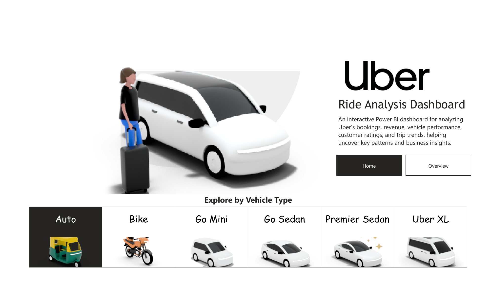
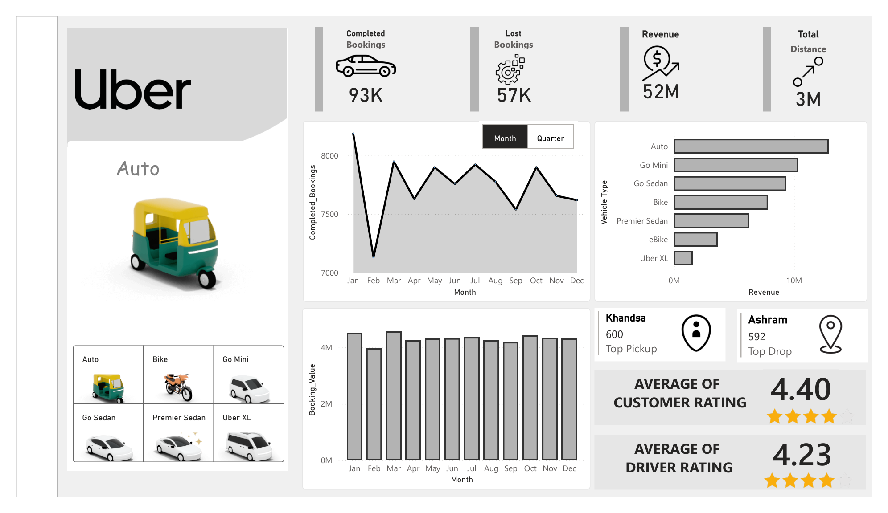

# Uber Ride Analysis Dashboard – Power BI

## Project Overview

An interactive Power BI dashboard built to analyze Uber ride performance across bookings, revenue, vehicle types, trip distance, locations, and customer/driver ratings.

The dashboard combines key performance indicators, time-based analysis, vehicle-level analysis, and interactive navigation to help identify important patterns and business insights.

## Objective

The objective of this project is to transform Uber ride data into an interactive business intelligence dashboard that helps users understand:

- Booking performance
- Lost and completed bookings
- Revenue performance
- Vehicle-wise performance
- Monthly and quarterly trends
- Pickup and drop-off activity
- Customer and driver ratings
- Overall ride-distance patterns

## Dataset

**Source file:** `uber.xlsx`

The dataset contains **150,000 ride records and 19 columns** covering booking, customer, vehicle, location, cancellation, financial, distance, rating, and payment information.

### Main Data Fields

- Date
- Time
- Booking ID
- Booking Status
- Customer ID
- Vehicle Type
- Pickup Location
- Drop Location
- Cancelled Rides by Customer
- Reason for cancelling by Customer
- Cancelled Rides by Driver
- Driver Cancellation Reason
- Incomplete Rides
- Incomplete Rides Reason
- Booking Value
- Ride Distance
- Driver Ratings
- Customer Rating
- Payment Method

## Tools & Technologies

- **Microsoft Power BI**
- **Power Query**
- **DAX**
- **Microsoft Excel**
- Data visualization and dashboard design

## Dashboard Pages

### 1. Home Page

The Home page provides a visual introduction to the project and includes:

- Uber Ride Analysis Dashboard title
- Project description
- Navigation between Home and Overview
- Interactive vehicle-type selector
- Dynamic vehicle imagery for different vehicle categories

### 2. Overview Page

The Overview page provides the main business analysis.

#### Key Performance Indicators

- **Completed Bookings:** 93K
- **Lost Bookings:** 57K
- **Revenue:** 52M
- **Total Distance:** 3M

#### Analysis Included

- Completed bookings by month
- Booking value by month
- Monthly / quarterly analysis
- Revenue by vehicle type
- Top pickup location by booking count
- Top drop location by booking count
- Average customer rating
- Average driver rating
- Vehicle-type filtering and interactive analysis

## Interactive Features

The dashboard includes interactive elements that allow users to explore the data dynamically.

### Vehicle Selector

Users can select vehicle types such as:

- Auto
- Bike
- Go Mini
- Go Sedan
- Premier Sedan
- Uber XL
- eBike

The selected vehicle is reflected in the dashboard's visual presentation.

### Time Analysis

The Overview page supports analysis at:

- Monthly level
- Quarterly level

This allows users to compare ride activity and revenue across different time periods.

## Key Metrics

| Metric | Value |
|---|---:|
| Total Records | 150,000 |
| Completed Bookings | 93K |
| Lost Bookings | 57K |
| Revenue | 52M |
| Total Distance | 3M |
| Average Customer Rating | 4.40 |
| Average Driver Rating | 4.23 |

## Dashboard Preview

### Home Page



### Overview Page



## Business Requirements

The original business requirements included analysis of:

- Overview KPIs
- Vehicle-level booking and revenue analysis
- Revenue by customer, vehicle, and payment method
- Rider cancellation analysis
- Rider segmentation
- Location and distance analysis
- Busy time slots and busy areas
- Additional report filters
- Hide/show filter panels

The current published dashboard focuses on the completed **Home** and **Overview** pages. The remaining analysis areas can be developed as future enhancements.

## Future Enhancements

Potential extensions to the dashboard include:

- Dedicated Vehicle Analysis page
- Revenue Analysis page
- Rider / Customer Analysis page
- Location Analysis page
- Cancellation-reason analysis
- Payment-method analysis
- Rider segmentation
- Busy time-slot analysis
- Busy-area analysis
- Detailed transaction table
- Additional filter panels

## Project Files

The repository contains the following project files:

```text
Uber_Ride_Analysis_Dashboared.pbix
Uber_Ride_Analysis_Dashboared(2).pdf
Uber Problems and Bussiness Requirements.docx
uber.xlsx
```

### Repository Structure

```text
Uber-Ride-Analysis-PowerBI/
│
├── README.md
│
├── Dashboard/
│   ├── Uber_Ride_Analysis_Dashboared.pbix
│   └── Uber_Ride_Analysis_Dashboared(2).pdf
│
├── Screenshots/
│   ├── Home.png
│   └── Overview.png
│
├── Dataset/
│   └── uber.xlsx
│
└── Documentation/
    └── Uber Problems and Bussiness Requirements.docx
```

## Learning Outcomes

Through this project, I practiced:

- Data understanding
- Data preparation
- Power Query transformations
- DAX measures
- KPI development
- Interactive dashboard design
- Time-based analysis
- Vehicle performance analysis
- Business-oriented data visualization
- Dashboard storytelling

## Author

**Shadab Momin**

Aspiring Data Analyst | Power BI | Excel | SQL | Python

---

## Disclaimer

This project is created for learning, portfolio, and data-analysis practice purposes. The dataset is used as provided for analytical and visualization practice.
